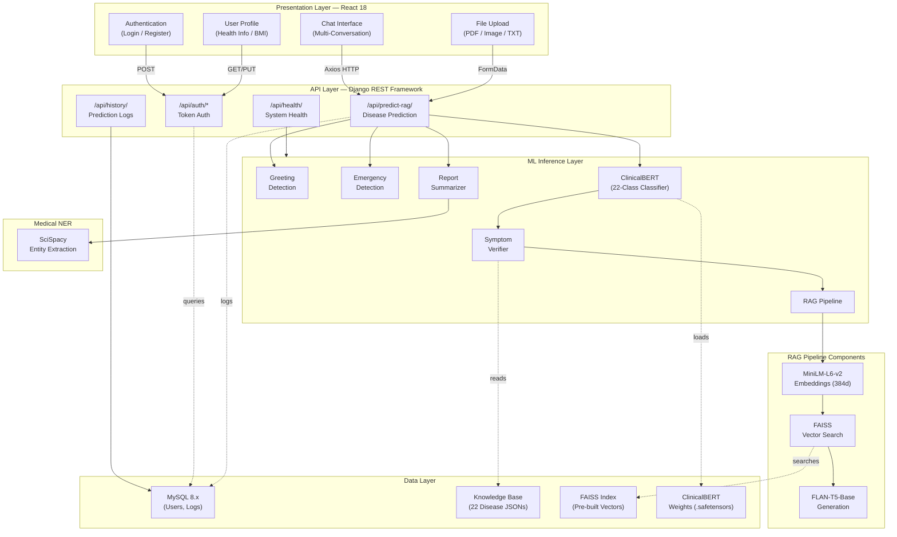
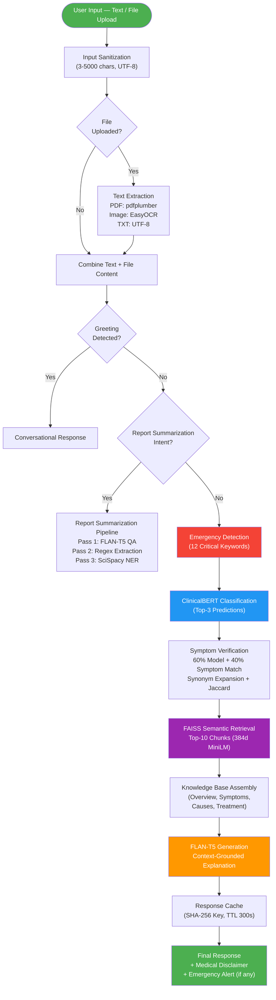
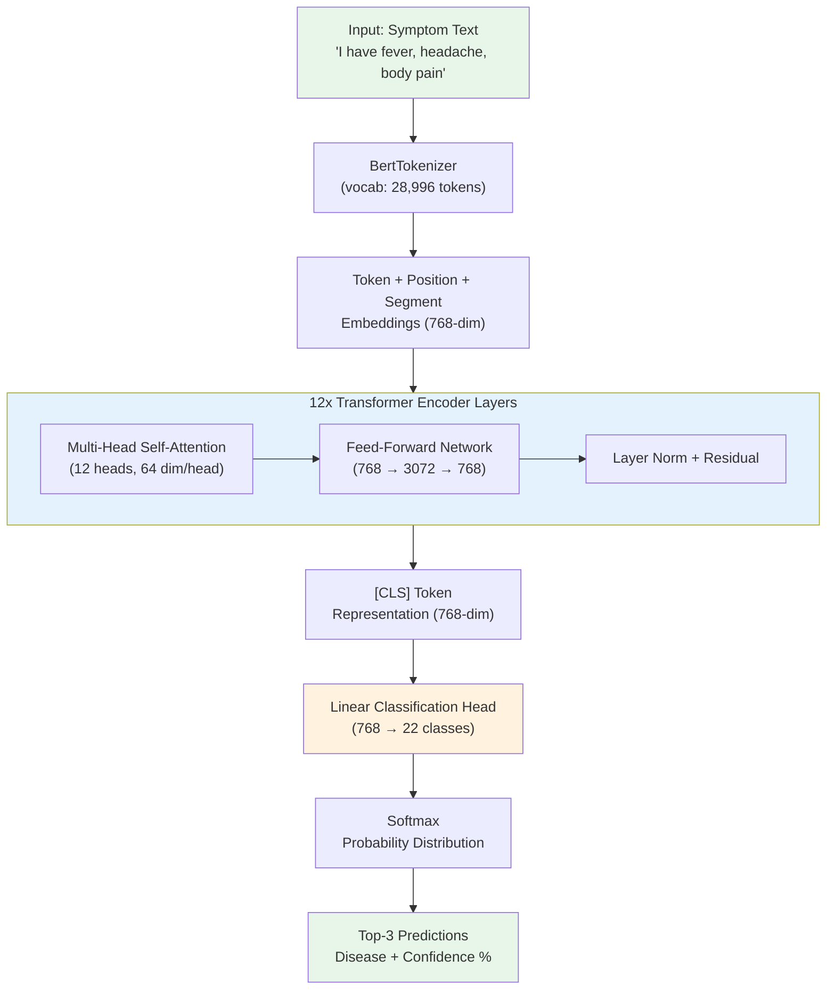
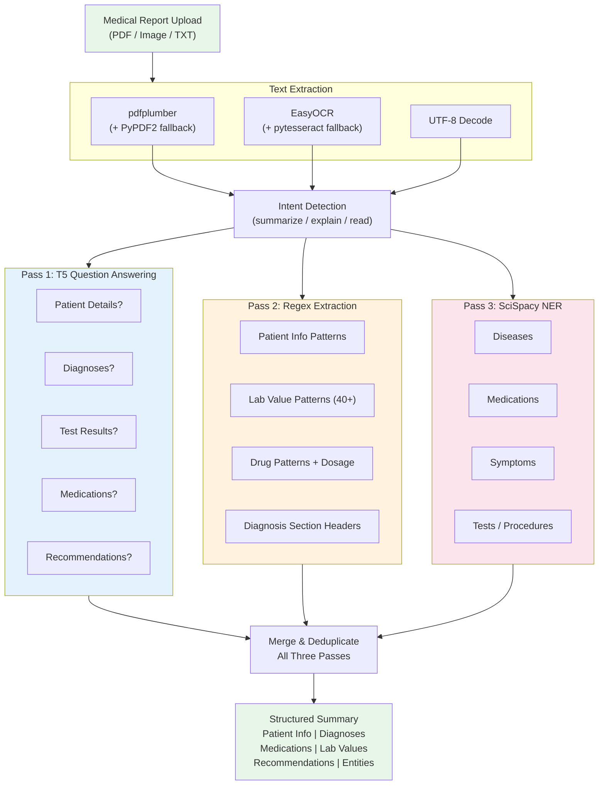
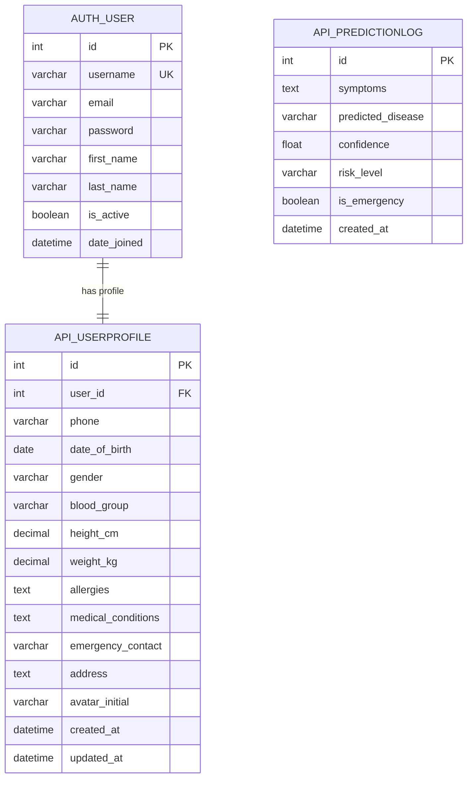
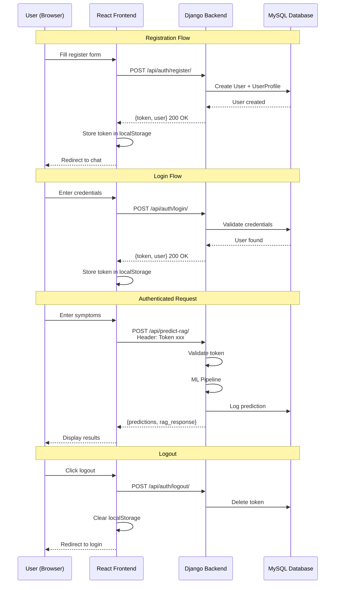

================================================================================
  MedAI — Architecture Diagrams for Research Paper
================================================================================
  
  These diagrams can be rendered using:
    - Mermaid Live Editor: https://mermaid.live
    - Draw.io (import Mermaid): https://app.diagrams.net
    - VS Code Mermaid Preview extension
  
  Copy each Mermaid code block into the renderer to get publication-ready
  PNG/SVG diagrams for your research paper.

================================================================================


================================================================================
DIAGRAM 1: SYSTEM ARCHITECTURE (4-Layer)
================================================================================

Use this for: Section 3.6 System Architecture / Figure 1




================================================================================
DIAGRAM 2: ML PIPELINE FLOWCHART (End-to-End)
================================================================================

Use this for: Section 3 Methodology / Figure 2




================================================================================
DIAGRAM 3: RAG PIPELINE DETAIL
================================================================================

Use this for: Section 3.5 Knowledge Retrieval / Figure 3

```mermaid
flowchart LR
    subgraph Input["Input"]
        Query["Symptom Query"]
    end

    subgraph Encoding["Encode"]
        MiniLM["all-MiniLM-L6-v2<br/>384-dim Vector"]
    end

    subgraph Retrieval["Retrieve"]
        FAISS["FAISS Index<br/>L2 Nearest Neighbor<br/>Top-K = 10"]
        Filter["Threshold Filter<br/>(distance ≤ 2.0)"]
    end

    subgraph Context["Assemble Context"]
        Chunks["Retrieved Chunks"]
        KB["Knowledge Base<br/>Disease Sections"]
        Prompt["Instruction Prompt<br/>Construction"]
    end

    subgraph Generation["Generate"]
        T5["FLAN-T5-Base<br/>Max Output: 512 tokens<br/>Temperature: 0.7"]
        Sanitize["Response Sanitization<br/>(Remove citations, URLs)"]
    end

    subgraph Output["Output"]
        Resp["Structured Response<br/>Overview | Symptoms<br/>Causes | Treatment<br/>Complications | Prevention"]
    end

    Query --> MiniLM
    MiniLM --> FAISS
    FAISS --> Filter
    Filter --> Chunks
    Chunks --> Prompt
    KB --> Prompt
    Prompt --> T5
    T5 --> Sanitize
    Sanitize --> Resp

    style MiniLM fill:#2196F3,color:#fff
    style FAISS fill:#9C27B0,color:#fff
    style T5 fill:#FF9800,color:#fff
    style Resp fill:#4CAF50,color:#fff
```




================================================================================
DIAGRAM 4: ClinicalBERT MODEL ARCHITECTURE
================================================================================

Use this for: Section 3.3 Symptom Classification Model / Figure 4




================================================================================
DIAGRAM 5: REPORT SUMMARIZATION PIPELINE
================================================================================

Use this for: Section 3.6 or a separate subsection / Figure 5




================================================================================
DIAGRAM 6: DATABASE ER DIAGRAM
================================================================================

Use this for: Database Schema section / Figure 6




================================================================================
DIAGRAM 7: AUTHENTICATION FLOW
================================================================================

Use this for: System design section (optional) / Figure 7




================================================================================
HOW TO USE THESE DIAGRAMS
================================================================================

1. Go to https://mermaid.live
2. Paste any code block above (between ```mermaid and ```)
3. The diagram renders instantly
4. Click "Export" → PNG or SVG (use SVG for best quality)
5. Insert into your research paper as Figure 1, 2, 3, etc.

Alternative tools:
    - Draw.io: File → Import → Paste Mermaid code
    - VS Code: Install "Mermaid Preview" extension
    - LaTeX: Use the mermaid-js package or export as PDF

Figure captions suggested:
    - Fig. 1: System architecture of the proposed MedAI framework
    - Fig. 2: End-to-end ML pipeline flowchart
    - Fig. 3: RAG pipeline for knowledge-grounded response generation
    - Fig. 4: ClinicalBERT model architecture for disease classification
    - Fig. 5: Multi-pass medical report summarization pipeline
    - Fig. 6: Database entity-relationship diagram
    - Fig. 7: Authentication and request flow sequence diagram

================================================================================
